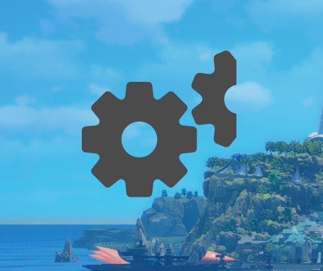
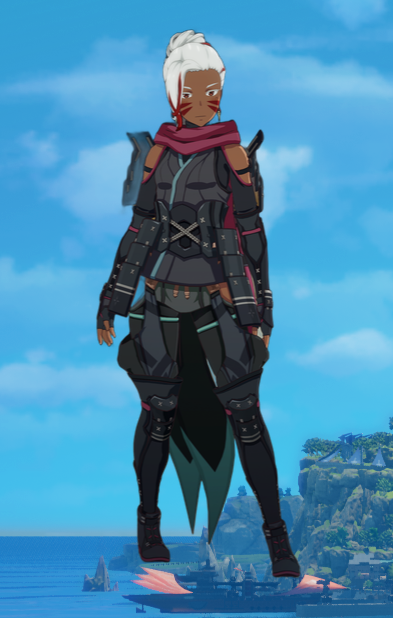

# Char Lab

キャラクターの 360 度画像を用いて、擬似的に 3D モデル風の表示を実現するソフトウェアです。

## アプリのダウンロード・インストール

アプリは[リリース一覧](https://github.com/TenTakano/CharLab/releases)からダウンロードすることができます。
アップデートされると随時リリースが公開されるので、最新版をダウンロードしてご利用ください。

ダウンロードしたアプリは一般的なインストール形式なので、ダブルクリックで起動できます。
Windows 版ではインストール時に「Windows によって PC が保護されました」という警告が表示される場合があります。その場合、「詳細情報」から実行することができます。

## アプリの使用方法

**アプリの実行には処理済みの 360 度画像が必要です。準備がまだの場合は[アプリで使用する画像について](#アプリで使用する画像について)を参照して準備してください。**

アプリを起動すると以下のように歯車の画像が表示されます。（キャラクターの画像がロードされていない場合は初回に限らずこの表示になります）

歯車を右クリックすることで、メニューが表示されるので、「フォルダの選択」を選び、キャラクターの 360 度画像が保存されているフォルダを選択してください。
フォルダが選択されるとフォルダ内の画像が読み込まれ、キャラクターが表示されます。以下のような表示となれば正常に読み込みが完了しています。

(画像は Bandai Namco Online の「BLUE PROTOCOL」で作成したスクリーンショットから背景を除去して使用しています。)

### 操作方法

- キャラクターの上で左クリックを押しながらドラッグすることで、キャラクターの向きを変更できます。
- キャラクターの上で Shift キー+左クリックを押しながらドラッグすることで、アプリを移動させることができます。
- キャラクターの上で右クリックするとメニューが表示されます。
  - フォルダを選択
    - キャラクターが保存されているフォルダを選択します。
    - 選択されたフォルダの画像を読み込み、表示に用いるデータを上書きします。
  - 自動再生する/自動再生を停止する
    - キャラクターの画像を自動で再生するかどうかを切り替えます。
  - 設定
    - 表示サイズや自動再生に関する詳細設定を行うウィンドウが開きます。
    - 詳細については[こちら](./doc/settings.md)を参照してください。
  - アプリを終了する
    - アプリが終了します。

## アプリで使用する画像について

アプリを release からダウンロードして実行してください。アプリの使用には、キャラクターの 360 度画像が必要です。
アプリを起動すると歯車が表示されるため、右クリックから「フォルダの選択」を選び、キャラクターの画像が保存されているフォルダを選択してください。選択したフォルダ内の画像が読み込まれ、キャラクターが表示されます。

フォルダには、キャラクターの画像が以下のように保存されている必要があります。

- ファイル名の先頭に連番が割り振られていること
  - （連番に基づいて画像が並び替えられます）
- 画像の拡張子が `.png`, `.jpg`, `.jpeg`, `.webp`, `.gif` のいずれかであること
- 画像のサイズが同一であること
  - （サイズが異なる場合、アプリの表示が崩れる可能性があります）
- 画像の背景が透明であること
  - （動作に影響はありませんが、背景が除去されていない場合は背景も一緒に表示されます）
- 最初の画像と最後の画像がつながるようになっていること
  - アプリ側で表示範囲の調整は行っていません。先頭と終端の画像がつながるようにフォルダ内に含める画像を調整してください。

上記の条件に従った画像を用意するためのスクリプトが `scripts` ディレクトリ内に配置されています。
使用方法は[doc/pre_process.md](./doc/pre_process.md)を参照してください。
