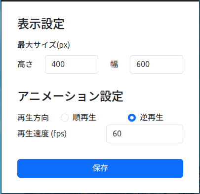

# 設定画面

## 表示設定

- 最大サイズ
  - 画像を表示する最大サイズを指定します。
  - 画像のサイズをこの枠内に収まるようアスペクト比を保ったままリサイズします。
  - （ウィジェット自体のサイズも画像のサイズに合わせて自動で調整されます）

## アニメーション設定

- 再生方向
  - 画像の再生方向を切り替えます。
  - 順再生は画像を連番の昇順に再生し、逆再生は連番の降順に再生します。
- 再生速度
  - 画像の再生速度を指定します。
  - 厳密な計算は行っていないため目安としてお使いください。
  - 数字を大きくするほど再生速度は早くなります。
